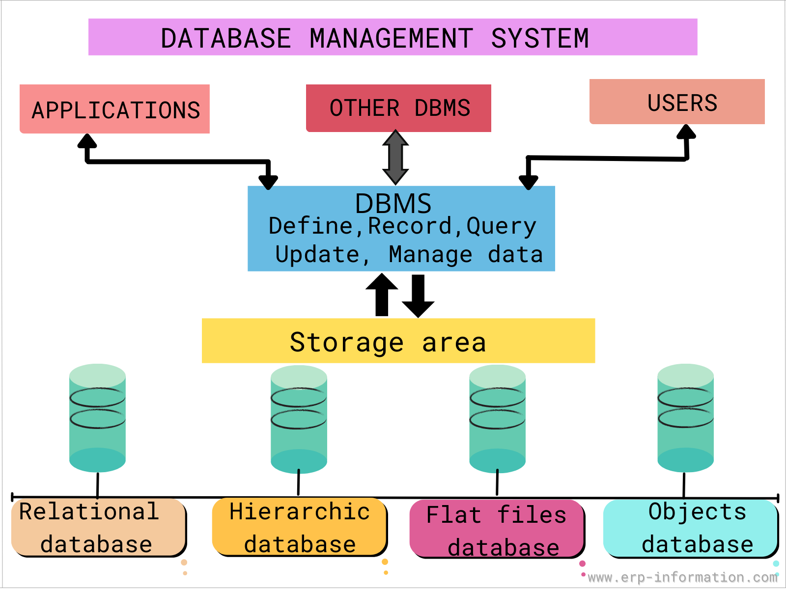
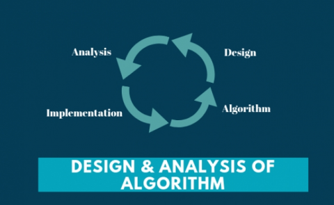

# 5TH-SEM Lab:- 

<ol>
<ul>
  <h2><li>Database management system:-</li></h2>
<ul>
  <h3>Database Management Systems (DBMS) are software systems used to store, retrieve, and run queries on data. A DBMS serves as an interface between an end-user and a database, allowing users to create, read, update, and delete data in the database.</h3></ul>
  
</ul>
</ol>
<ol>
<ul>
  <h2><li>Design And Analysis Of Algorithms:-</li></h2>
<ul>
  <h3>a sequence of steps to solve a problem. Design and Analysis of Algorithm is very important for designing algorithm to solve different types of problems in the branch of computer science and information technology.</h3></ul>
  
</ul>
</ol>
<ol>
<ul><h2><li>Compiler Design:-</li></h2>
<ul><h3>Compiler design principles provide an in-depth view of translation and optimization process. Compiler design covers basic translation mechanism and error detection & recovery. It includes lexical, syntax, and semantic analysis as front end, and code generation and optimization as back-end.</h3></ul>
  
</ul>
</ol>
<!---and there are the end--->
